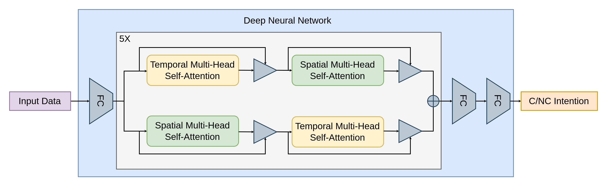
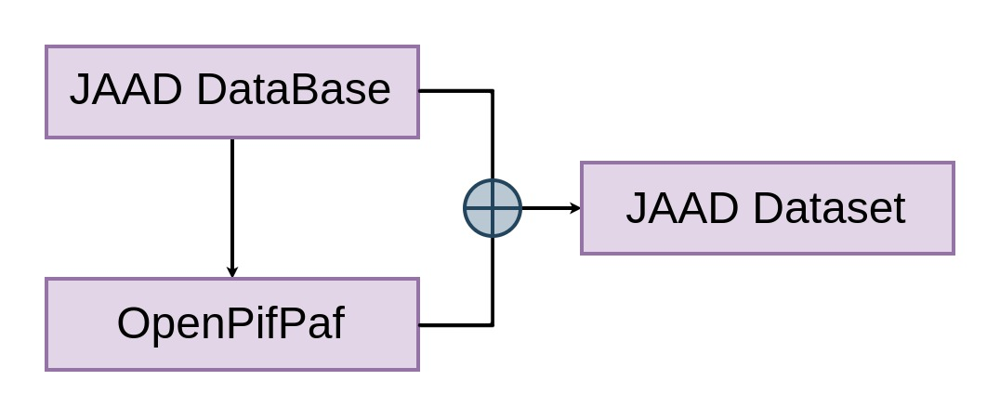
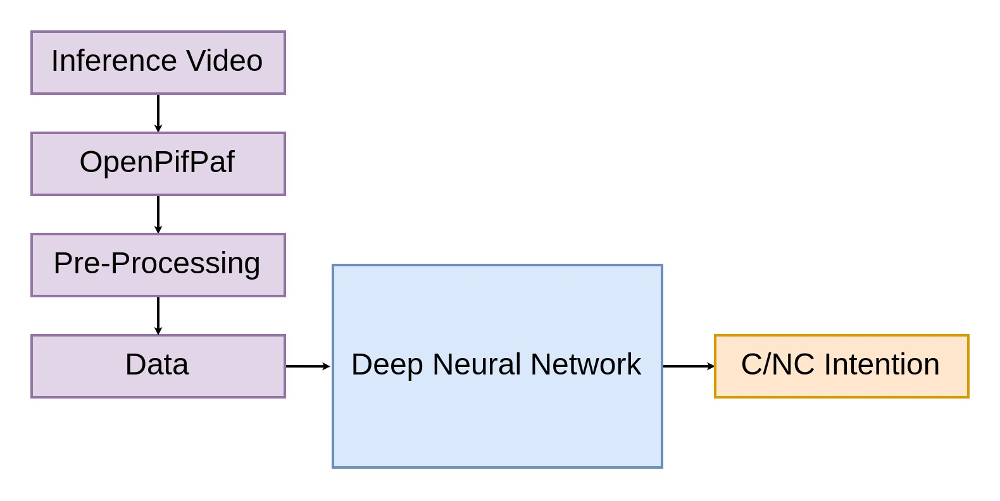
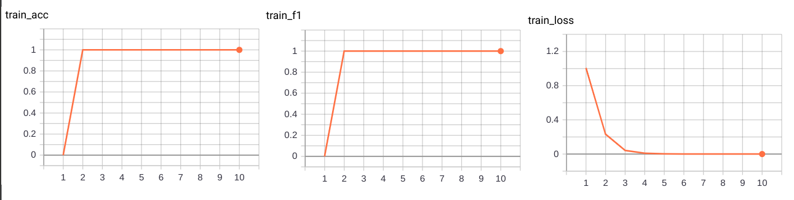
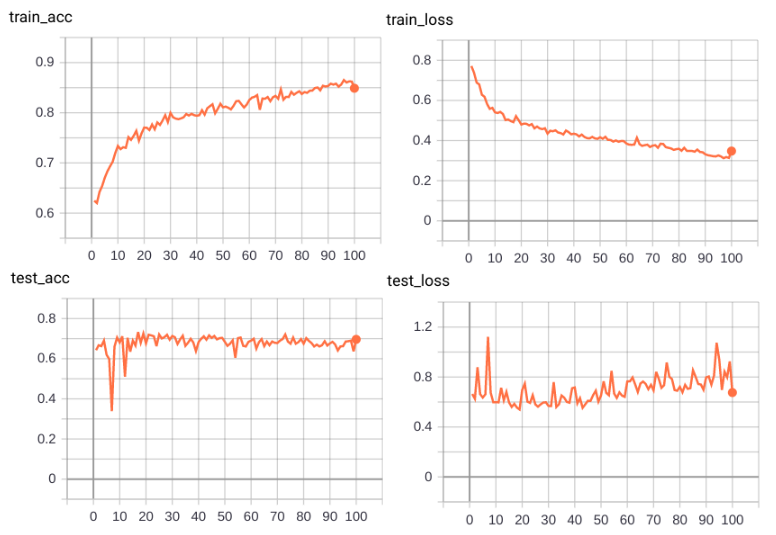
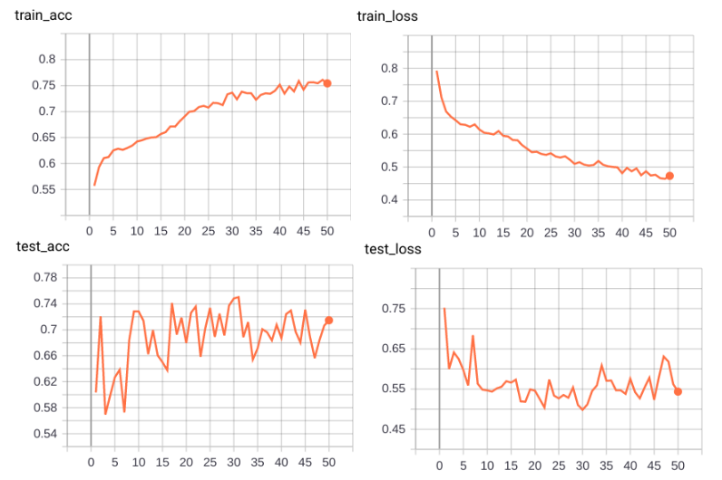
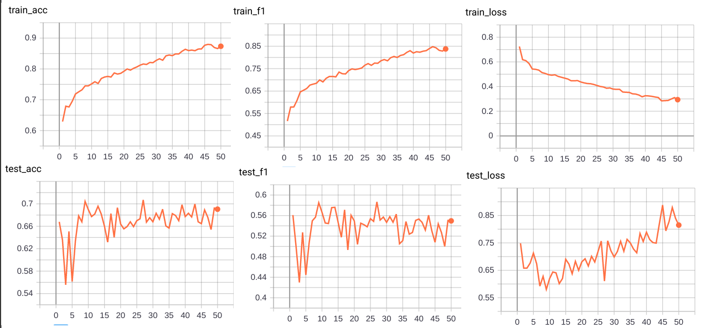
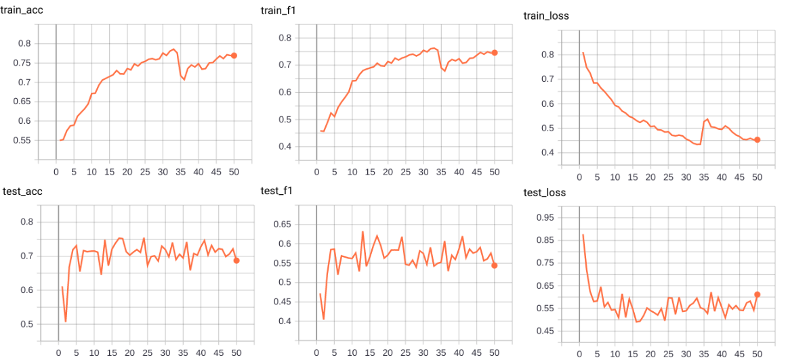

# Project - Pedestrian Intention Predicition 

*<p style="text-align: center;">This project was made in the context of the [CIVIL-459:Deep Learning for Autonomous Vehicles](https://edu.epfl.ch/coursebook/en/deep-learning-for-autonomous-vehicles-CIVIL-459) course at EPFL. The goal was to solve a task related to autonomous vehicles using deep learning that bring a contribution to the state of the art in order in the end to reproduce the autopilot of an Autonomous Vehicle.</p>*

## Contents

1. [Project Motivation & Objectives](#1---project-motivation--objectives)
2. [Contribution Overview](#2---contribution-overview)
    1. [Dataset Creation](#21---dataset-creation)
    2. [Model Modification and Adaptation for Training & Testing](#22---model-modification-and-adaptation-for-training--testing)
    3. [Inference Data Creation & Model Prediction](#23---inference-data-creation--model-prediction)
3. [Description of the Data](#3---description-of-the-data)
    1. [JAAD Dataset](#31---jaad-dataset)
    2. [Inference Data](#32---inference-data)
4. [Experimental Setup and Results](#4---experimental-setup-and-results)
    1. [Experimental Setup](#41---experiments-setup)
        1. [Metrics](#411---metrics)
        2. [Overfitting](#412---overfitting)
        3. [1. Bounding box only](#1-bounding-box-only)
        4. [2. Regularization + Less complex model](#2-regularization--less-complex-model)
        5. [3. Keypoints](#3-keypoints)
        6. [4. Bounding box, occlusion + keypoints + 1s prediction, 1s seqence](#4-bounding-box-occlusion--keypoints--1s-prediction-1s-seqence)
        7. [5. Bounding box, occlusion + keypoints + 1s prediction, 1s seqence + dynamic detection to identify the pedestrian](#5-bounding-box-occlusion--keypoints--1s-prediction-1s-seqence--dynamic-detection-to-identify-the-pedestrian)
    2. [Results](#results)
        1. [Overfitting](#overfitting)
        2. [1. Bounding box only](#1-bounding-box-only-1)
        3. [2. Regularization + Less complex model](#2-regularization--less-complex-model-1)
        4. [3. keypoints](#3-keypoints-1)
        5. [4. Bounding box, occlusion + keypoints + 1s prediction, 1s seqence](#4-bounding-box-occlusion--keypoints--1s-prediction-1s-seqence-1)
        6. [5. Bounding box, occlusion + keypoints + 1s prediction, 1s seqence + dynamic detection to identify the pedestrian](#5-bounding-box-occlusion--keypoints--1s-prediction-1s-seqence--dynamic-detection-to-identify-the-pedestrian-1)
        7. [Best Checkpoint Result Comparison](#best-checkpoint-result-comparison)
5. [Conclusion](#conclusion)


## 1 - Project Motivation & Objectives

<div style="text-align: justify">&emsp; In this project we implemented a model predicting the crossing intention of pedestrians in the context of autonomous driving. Intention predicting models in this field are important for both safety and efficiency. It helps autonomous vehicles anticipate pedestrian behavior, adjust their actions accordingly, and reduce the risk of accidents. It can also improves traffic flow by allowing vehicles to plan maneuvers in advance, avoiding sudden stops or delays.</div>

<br>

&emsp;This report describes the problem, the project, and the experimental results in details.
## 2 - Contribution Overview

<p align="center">
    
</p>

<div style="text-align: justify"> &emsp; To solve the problem we were assigned, we choose to base our model on the MotionBert model, a current state of the art model for 3D pose estimation and action recognition. While some of those tasks are not directly related to our project, we believe that the part of the model implemented for action recognition could be adapted to our problem. In this project, our contribution is to adatpt the already existing MotionBert model to take as input 2D keyposes and bounding boxes, and to predict Crossing/Not-Crossing intentions.</div>

### 2.1 - Dataset Creation

<p align="center">
    
</p>


<div style="text-align: justify"> &emsp; Our Dataset is based on the JAAD Dataset containing videos with annotations. It is often used to train Deep Learning models in the context of autonomous driving. The motivations for choosing such a Dataset will be further developped in the next section. A first step was to understand the structure of the Dataset, and to get familiar with the annotations. As our model needs sequences of specific data only from relevant pedestrians, a new Dataset was created to best fit our needs. Most of the annotations provided by the Dataset were discarded only to keep a few such as bounding boxes and occlusion. The Dataset was then organized in sequences of 1 seconds, overlapping each other by 0.5 second to best capture the motion of the pedestrian. Since the JAAD model provides a Crossing/Not-Crossing label for each frame, a new label per sequence was created and assigned to the sequence if at least one frame of the sequence was labeled as Crossing.</div>

<br>

<div style="text-align: justify">&emsp; After training and testing the model only with the bounding boxes, we realized that we would need much more data to get better, and more accurate results. To this end, keypoints of the pedestrians generated by OpenPifPaf for each JAAD video were added to the Dataset. In order to do so, and since the keypoints generation was a long process, a checkpoint file system was implemented to save the new keypoints after each video analyzed. To link the keypoints to the right JAAD bounding box, a cross check had to be implemented for each frame analized to make sure that the keypoints were assigned to the right bounding box.</div>

<br>

<div style="text-align: justify">&emsp; To better analyse the newly created Dataset, and the results of our model, specific functions were created to visualize the Dataset, and to get statistics on it. The Dataset was then split into a training set and a testing set. We made sure that all the sequences corresponding to the same video were in the same set to avoid prediction in the testing set of training data which would bias ou estimate of the accuracy.</div>

### 2.2 - Model Modification and Adaptation for Training & Testing

<p align="center">
    
</p>
 
<div style="text-align: justify">&emsp; We first spent time to get acquainted with MotionBert, and we ran the main functions originally created for the model such as the training function or the testing function. This step was important to get a more precise idea the current structure and work needed, of the functions to implement to adapt to our needs, and the ones to get rid of.</div> 

<br>

<div style="text-align: justify">&emsp; To process and extract data from the Dataset pickle file previously created and intended for our model, we created new Dataset subclasses (for bounding boxes only, for keypoints only and for bounding boxes & 2D keypoints) returning the data in the right format for the training and testing DataLoader.</div>

<br>

<div style="text-align: justify">&emsp; A new training file was created implementing the important training, validating and evaluating function (to respectively train, test and evaluate the network). This training file was modified to take into account the new Dataset subclasses, and a new specific configuration file JAAD_train.yaml previously created to store the network specifications and the choosen training parameters.

<br>

&emsp;In the training function we implemented a system to save the latest_epoch checkpoint, in order to be able to resume to it whenever we wanted, and a system that saves the best checkpoint (the one with the best accuracy).

&emsp;We also used tensorboard to create logs monitoring 3 metrics : the loss, the accuracy and the f1-score. This way we could use the tensorboard interface to visualizate the evolution of those scores through the epoch for both training and testing.

&emsp;Finally we also used tensorboard to create a model visualization in order to explore freely in a visual interface the characteristics and structure of the model.</div> 

### 2.3 - Inference Data Creation & Model Prediction

<p align="center">
    
</p>

<div style="text-align: justify">&emsp; In order to be able to run the inference.py file, the created model needs as input 2D keypoints, bounding boxes and occlusion scores. Since this is not provided in the video for inference, we had to create it. To generate this data, a new function was written to run OpenPifPaf on the videos, and to store the generated keypoints and bounding boxes in a pickle file, and the keypoints are then processed in another function to best adapt to the model's input.</div>

<br>

<div style="text-align: justify">&emsp; A new inference file (containing the above functions) was created to make predictions on any video, and the to save them in a json file. This file was also modified to support a new Dataset subclasses KPInfDataset loading the pickle file storing the inference data extracted from the inference video. This file allows to run the model on the processed inference data, and to save the predictions with their correspondant pedestrian bounding box in a json file.</div>

<br>

<div style="text-align: justify">&emsp; To visualize and better evaluate the results of the inference, a new function was created to draw the bounding boxes on the videos with the predicted labels, and to save it as a new video. To do, this function takes as input the inference video, and the json file containing the predictions.</div>

## 3 - Description of the Data

### 3.1 - JAAD Dataset

The pickle datafile contaning the JAAD dataset processed for our model has the following dictionnary structure:
``` 
'annotations': 
    'vid_id'(str): 
        'num_frames':               int
        'width':                    int
        'height':                   int
        'ped_annotations':          list (dict)
            'ped_id'(str):              list (dict)
                'old_id':                   str
                'frames':                   list (int)
                'occlusion':                list (int)
                'bbox':                     list ([x1 (float), y1 (float), x2 (float), y2 (float)])
                '2dkp':                     list (array(array))
                'cross':                    int
'split': 
    'train_ID':     list (str)
    'test_ID':      list (str)
'ckpt': str
'seq_per_vid': list (int)
```

Dictionnary keys :
- `'annotations'` - list of video dictionnaries used for training and testing the model
- `'vid_id' (str)` - dictionnary of the properties for the video `'vid_id'`
- `'width'` - width of the video `'vid_id'`
- `'height'` - height of the video `'vid_id'`
- `'ped_annotations' (str)` - list of pedestrians in the video `'vid_id'`
- `'ped_id (str)'` - list of sequences annotations dictionnaries for pedestrian `'ped_id (str)'`
- `'old_id'` - default `'old_id'` from the JAAD Dataset
- `'frames'` - list of frame number relative to the video `'vid_id'` contained in the current sequence
- `'occlusion'` - list of occlusion for all the frames contained in the current sequence containing the frames `'frames'`
- `'bbox'` - list of bounding boxes for all the frames contained in the current sequence containing the frames `'frames'`
- `'2dkp'` - list of arrays of 2D keypoints for all the frames contained in the current sequence containing the frames `'frames'`
- `'cross'` - label cross (0 or 1) for the current sequence containing the frames `'frames'`
- `'split'` - dictionnary with the `'train_ID'` and `'test_ID'`
- `'train_ID'` - list of `'vid_id'` contained in the training set (80% of the data)
- `'test_ID'` - list of `'vid_id'` contained in the testing set (20% of the data)
- `'ckpt'` - last `'vid_id'` that was being processed
- `'seq_per_vid'` - list of number of sequences per video for all videos


### 3.2 - Inference Data

Dictionary structure:
```
'vid_id':           str
'num_seq':          int
'forecast_step':    int
'nbr_frame_seq':    int
'total_frame_vid':  int
'width':            int
'height':           int
'per_seq_ped':      list (list (int))
'ped_annotations':      list (dict) 
    'frames':               list (int)
    'occlusion':            list (int)
    'bbox':                 list ([x1 (float), y1 (float), x2 (float), y2 (float)])
    '2dkp':                 list (array(array))
```

Dictionnary keys :
- `'vid_id'` - filename of the inference video without extension
- `'num_seq'` - number of sequences created
- `'forecast_step'` - overlap step between sequences
- `'nbr_frame_seq'` - number of frames per sequences
- `'total_frame_vid'` - total number of frames in the video
- `'width'` - width of the inference video
- `'height'` - height of the inference video
- `'per_seq_ped'` - list of list of index of pedestrian for each sequence
- `'ped_annotations'` - list of pedestrians in the inference video
- `'frames'` - list of frame number relative to the inference video contained in the current sequence of the current pedestrian
- `'occlusion'` - list of occlusion for the current pedestrian for all the frames contained in the current sequence containing the frames `'frames'`
- `'bbox'` - list of bounding boxes for the current pedestrian for all the frames contained in the current sequence containing the frames `'frames'`
- `'2dkp'` - list of arrays of 2D keypoints for the current pedestrian for all the frames contained in the current sequence containing the frames `'frames'`


## 4 - Experimental Setup and Results

<div style="text-align: justify">&emsp; During the conception of this project, we had to make some experiments to find the best model for our problem. This section will describe the experiments we made and the results we obtained.</div>

### 4.1 - Experiments Setup

#### 4.1.1 - Metrics

&emsp; To evaluate the performances of our model, **three main metrics** were used: the ***loss***, the ***accuracy*** and the ***F1 score***.

<div style="text-align: justify">&emsp;The loss is computed by the model during both the training and the testing. We compute a CrossEntropyLoss for our model. The accuracy is the percentage of correct prediction made by the model both on the training set and the testing set. To make the prediction we choose the class (crossing or not crossing) that get the highest softmax probability. This way of computing the loss and accuracy may create what we observe in the result : the fact that for the training the loss increase but the accuracy stays pretty much constant. The F1 score is the harmonic mean of the precision and recall. The precision is the percentage of correct positive prediction made by the model. The recall is the percentage of positive prediction made by the model that are correct. We compute the F1 measure also on the training and testing set. However we start using the F1 measure latter in the experimental process so for the 2 first experiment, we don't have f1-score data</div>

#### 4.1.2 - Overfitting 

<div style="text-align: justify">&emsp; To make sure our system could model the problem, we first made sure that it was able to overfit a small portion of the training set. A small training set of 10 sequences was used and the model was trained for 20 epochs. It was observed that the model was able to overfit the training set, and it was thus concluded that data could be modeled by our system.</div>

#### 1. Bounding box only
<div style="text-align: justify">&emsp; The first tried to give to the model only the bounding boxes of the pedestrian. It contains the position of the pedestrian in the image, and we thus thought that it could be enough for the model to predict the crossing intention (most of the time the car has a camera from the point of view of the driver then the relative position of a pedestrian in the image could be good enough to predict his intention).
We used scitas and Google Collab to generate the Dataset and train the model. We also used the same hypeparameters as the one used in the original paper, and we juste changed the dimension of the input and output of the network.</div>

#### 2. Regularization + Less complex model
<div style="text-align: justify">&emsp; The result of the first experiment was satisfying. However it was quickly overfitting thus we thought that the model was maybe too complex for our problem. We decided to use a less complex model and to add some regularization.</div>

<br>

<div style="text-align: justify">&emsp; To do so, we looked into the structure of the model in the original paper. By using tensorboard visualization, we noticed that the model was composed of 5 blocks of spatial and temporal encoding layers in the original architecture. This number seems to be too high when considering that the model only has bounding boxes as input. We thus decided to reduce the number of blocks to 2, and we added some regularization to the model by increasing the weight decay and the dropout rate.</div>

#### 3. Keypoints
<div style="text-align: justify">&emsp; The second experiment shows encouraging result, but we still wanted to improve our accuracy. We thus decided to give more information to the model, and we decided to use 2D pose keypoints to the input of the model. As JAAD doesn't have any keypoint annotations, we used OpenPifPaf to estimate them for all the videos.</div>
<br>
<div style="text-align: justify">&emsp;We thought that it could help the model to better understand the position of the pedestrian, more specificaly that the model would then be able to understand how the pedestrian walks, and his orientation when crossing the road. Moreover, the structure of MotionBert was originally trained to use keypoints as input, so we thought that it could be a good idea to use them.</div>

#### 4. Bounding box, occlusion + keypoints + 1s prediction, 1s seqence:
<div style="text-align: justify">&emsp;The third experiment achieved a better accuracy and a good f1-score. We however noticed that OpenPifPaf occasionnally could not detect the pedestrian. To counter this issue, the ground thruth bounding boxes from JAAD were added to the Dataset for the model. We also provided it with the the occlusion score to give it more information.</div>
<br>
<div style="text-align: justify">&emsp; We also increased the prediction time to 1 second instead of 0.5 second. We thought that it could help the model to better understand the intention of the pedestrian. We also showed 1 second of annotations instead of 2 seconds before, this would in theory allow the model to generalize better.</div>

#### 5. Bounding box, occlusion + keypoints + 1s prediction, 1s seqence + dynamic detection to identify the pedestrian:

<div style="text-align: justify">&emsp; As our last experiment result were worse than the ones we previously add, we decided to try to use a dynamic detection to identify the pedestrian in the video. Instaed of relying on a constant distance between the center of a bounding box and the center of a set of keypoints, this distance now varies with the size of the bounding box to make it more robust to the pedestrian distance in the image. </div>

### Results

#### Overfitting :



As we can see on the plot, the model is able to overfit on a little training set. We achieved an accuracy of 100%, F1 of 1 and a loss of 0. This is a good sign that the model is able to learn.

#### 1. Bounding box only

- <u>during training :</u>



- <u>discussion :</u> 

<div style="text-align: justify">&emsp;The result are pretty satisfying for a first experiment. We're able to achieve an accuracy of 70 % in average only with the bounding box. However, we can see that the model is overfitting very quickly. We think this is because the model is too complex for the low complexity input.</div> 

<div style="text-align: justify">&emsp;For the next experiment we decided to reduce the complexity of the model and to add some regularization in order to try to solve the overfitting problem.</div>

#### 2. Regularization + Less complex model

- <u>during training :</u>



- <u>discussion :</u> 

<div style="text-align: justify">&emsp; As we can see on the results, We managed to reduce overfitting of the model by doing this (training accuracy around 75% instead of 82% at the epoch 50) and we even increased the accuracy on the testing set.</div>

<div style="text-align: justify">&emsp; As a next step we thought that giving the model more information could help it to better understand the problem. Thus we decided to try to give him the keypoints of the pedestrian.</div>


#### 3. keypoints

- <u>during training :</u>


- <u>discussion :</u>

<div style="text-align: justify">&emsp; The results show significant improvement. By using 2D keypoint instead of the bounding boxes, we managed to achieve better average and final accuracy and the loss is better. We start monitoring the f1-score and we can see that it is also a satisfying.</div>

<div style="text-align: justify">&emsp; However we noticed in the dataset that some of the pedestrian keypoints are not present on certain frame, the model we use didn't manage to detect them, so as a next improvement we wanted to try to add the bbox with the keypoints.</div>

#### 4. Bounding box, occlusion + keypoints + 1s prediction, 1s sequence

- <u>during training :</u>



- <u>discussion :</u> 

<div style="text-align: justify">&emsp;As we can see in the result, this experiment didn't bring any improvement, and it performs even worse than with just the keypoints. We think that this can be caused by the fact that originally, the purpose of bringing the bounding box was that the model may be able to have informations even when openepifpaf doesn't detect keypoints. However if the detection gives wrong keypoints, it can cause errors in the identification of the pedestrian or just comprehension errors for the model that can't learn to use the bounding box to estimate the position when he doesn't have the keypoints. For this reason we decided to try to use a dynamic detection to identify better which keypoints correspond to which pedestrians.</div>

#### 5. Bounding box, occlusion + keypoints + 1s prediction, 1s sequence + dynamic detection to identify the pedestrian

- <u>during training :</u>



- <u>discussion :</u> 

<div style="text-align: justify">&emsp;As we can see on the result, we achieved the highest accuracy, and f1-score and the lowest loss with this experiment. Indeed for the best checkpoint we have, the mean accuracy and f1 measure seems to be improved (0.7545 vs 0.7044 or 0.7442 for the accuracy and 0.6184 vs 0.5850 or 0.5949 for the f1 measure). We can thus see that the model is also able to generalize a bit better. We can thus conclude that the dynamic detection is a good idea to improve the result of the model.</div>

#### Best Checkpoint Result Comparison :

| Experiment | Loss | Accuracy | F1 score |
|------------|------|----------|----------|
|     5      | 0.4954 | 0.7545 | 0.6184   |
|     4      | 0.5084 | 0.7044 | 0.5850   |
|     3      | 0.6488 | 0.7442 | 0.5949   |
|     2      | 0.5120 | 0.7503 |    -     |
|     1      | 0.5399 | 0.7255 |    -     |

## Conclusion

<div style="text-align: justify">&emsp; To conlude, our contribution task was to create a deep learning application using MotionBert to predict the crossing intention of pedestrians in the context of autonomous driving. We tried and experimented different ideas to solve the problem and we managed to create a model that is able, even if it's not with an astonishing accuracy, to predict the crossing intention of pedestrians and that can make an inference on raw video data.</div>

<div style="text-align: justify">&emsp; This model is however not able to generalize and tends to still overfit quickly the training set. We think that the problem comes from the fact that the Dataset is too small and we don't have ground truth keypoints. Indeed for a complex model like MotionBert, we have a very little amount of samples, even after cutting JAAD into sequences of 1 second. Moreover, we don't have ground truth keypoints, so we have to use openpifpaf to detect the keypoints and this can cause some errors in the identification of the pedestrian. We think that if we had a bigger Dataset with ground truth keypoints, we could have a better model.</div>

#### Further improvements :

<div style="text-align: justify">&emsp; We still think that our application have a great potential and that it could be improved in many ways. Here are some ideas that we think could improve the performances of our model :</div>

- Use a **bigger Dataset** like the PIE Dataset that contains a lot more samples and video time than JAAD or use a Dataset that contains ground truth keypoint.
- Use **semi-supervised learning** to use the unlabeled data of the JAAD Dataset (or PIE Dataset) to train the model, allowing it to generalize better and to create a pre-knowledge on what is a pedestrian and how it behaves (we could try for example to first predict his displacement and then his crossing intention).
- Use **semi-supervised learning** on a another Dataset to pretrain the model and then fine-tune it on JAAD or PIE. If we take the example of MotionBert we could train first our model to predict the 3D pose of a person from a 2D pose, this way it would get an deeper understanding on the what is a pose, and then fine-tune it to predict the crossing intention of a pedestrian.
- Try to **improve the detection step** of the pose with openpifpaf on the video. Indeed, we noticed that the keypoints given by openpifpaf are not always correct and that it can cause some errors in the identification of the pedestrian. We could try to solve this problem by finding ways to ensure the best detection possible.
